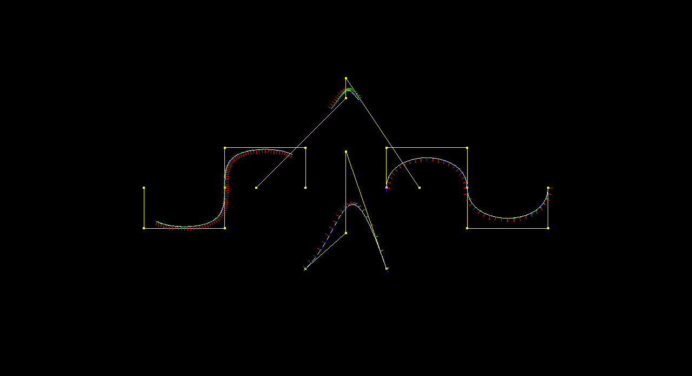

# CS-C3100 Computer Graphics, Fall 2021

This repository contains my solutions to the assignments of the Computer Graphics course.

## Features

Cone Generation:

Mesh Simplification:

Curves:

Surfaces of Revolution:

.png)
.png)
.png)
.png)
.png)
.png)

Generalized Cylinders:

.png)
.png)

Subdivision:

Hierarchical Modeling:

Physical Simulation:

Ray Tracing:

Real-time Shading:

